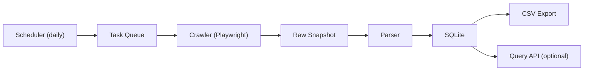

# 携程机票爬虫开发设计文档（MVP）

> 约束：只访问公开页面/公开请求；不绕过验证码/登录；触发风控则暂停。

## 1. 背景与目标
**目标**：基于携程主站公开机票查询页，抓取单条航线的日最低价，保存到本地数据库，并每日滚动更新。

**范围（MVP）**
- OTA：携程主站
- 路线：单条（用户指定）
- 价格口径：最低价（含税价，若页面可见）
- 时间窗口：未来 N 天（建议 30 天）
- 存储：SQLite + CSV

**非目标**
- 不做自动绕过验证码
- 不做下单流程
- 不做多 OTA 比价

## 2. 架构设计
### 2.1 数据流

### 2.2 组件说明
- **Scheduler**：每天生成日期任务（未来 30 天），跳过已抓取日期。
- **Crawler (Playwright)**：打开携程公开机票查询页面，抓取最低价。
- **Parser**：从页面/请求响应中解析最低价。
- **Storage**：
  - SQLite 保存结构化数据
  - Raw Snapshot 保存原始 HTML/JSON 便于回溯
- **Exporter**：生成 CSV 给 Excel。

## 3. 数据模型
**price_observation**
- ota, origin, destination, date
- min_price, currency
- captured_at

**raw_snapshot**
- ota, origin, destination, date
- raw_path
- captured_at

**crawler_error**
- ota, origin, destination, date
- error_type, error_message
- created_at

## 4. 阶段性任务拆分
### 阶段 1（MVP）
1. 固定路线和日期范围
2. Playwright 能打开搜索页并抓取最低价
3. 数据落库 + CSV 输出

### 阶段 2（日更调度）
1. 每天滚动 30 天
2. 跳过已抓取日期
3. 失败重试（有限）

### 阶段 3（质量控制）
1. 采样与人工对比
2. DOM 变更检测
3. 失败原因统计

## 5. 测试与验收
### 测试
- Parser：固定 HTML/JSON 解析最低价
- 集成：1 条路线 1 天完整抓取成功

### 验收
- 成功率 ≥ 80%
- 最低价字段不为空
- CSV 可直接用于 Excel

## 6. 风险与对策
| 风险 | 对策 |
|------|------|
| 页面结构变化 | 保存 Raw Snapshot，快速更新 Parser |
| 验证码/风控 | 停止抓取，记录失败 |
| 报价不含补贴 | 明确口径为页面显示最低价 |

## 7. 需要确认参数
1. MVP 路线（请指定，如 PVG→URC）
2. 滚动窗口长度（建议 30 天）
3. 抓取频率（每日一次）
